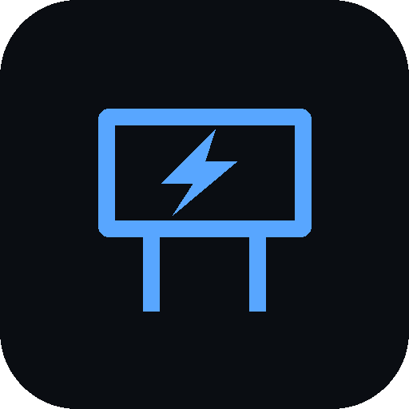
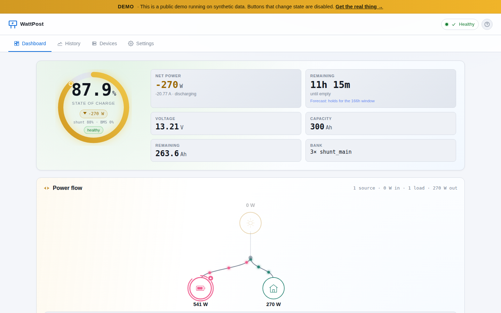

<p align="center">
  
</p>

<h1 align="center">WattPost</h1>

<p align="center">
  Local-first, multi-vendor solar and battery monitoring for off-grid setups.<br>
  Runs on a Raspberry Pi or any Docker host. Your data never leaves your network.
</p>

<p align="center">
  <a href="LICENSE"></a>
  <a href="https://github.com/ritualnorth/wattpost/releases"></a>
  <a href="https://github.com/ritualnorth/wattpost/pkgs/container/wattpost-appliance"></a>
  <a href="https://github.com/ritualnorth/wattpost/discussions"></a>
</p>

<p align="center">
  <b><a href="https://demo.wattpost.io">Live demo</a></b> &nbsp;·&nbsp;
  <a href="https://wattpost.io">Website</a> &nbsp;·&nbsp;
  <a href="docs/getting-started.md">Docs</a> &nbsp;·&nbsp;
  <a href="docs/supported-hardware.md">Supported hardware</a>
</p>

<p align="center">
  <a href="https://demo.wattpost.io"></a>
</p>

<p align="center"><sub>The live demo runs on synthetic data &middot; <a href="https://demo.wattpost.io">demo.wattpost.io</a></sub></p>

---

I built this to monitor my off-grid workshop without handing anyone my data. It
runs on a Raspberry Pi or any Linux Docker host, polls solar/battery gear over
Bluetooth (or wired serial when BLE is flaky), and serves a live dashboard.
**Local-first: no cloud account required to see your own battery.**

## What it covers

BLE-first, multi-vendor coverage for mixed off-grid setups:

- **Renogy** Rover MPPTs, DCC DC-DC combos, smart batteries, shunts, 1-3 kW
  inverter-chargers (BT-1/BT-2 BLE or USB-RS485)
- **Victron** SmartShunt, BMV-7xx, SmartSolar MPPT, Orion DC-DC, Blue Smart AC
  Charger, SmartLithium, Lynx Smart BMS, SmartBatteryProtect, Phoenix Inverter
  (BLE Instant Readout or VE.Direct wired)
- **JK BMS** native BLE (JK02-24S, JK02-32S, JK04)
- **JBD / Overkill, Daly, AiLi, Junctek** BLE shunts and BMSes
- **EPEVER / EPSolar** Tracer MPPTs over USB-RS485
- **Mopeka Pro / Check Pro** tank sensors, **Govee + Ruuvi** ambient probes
- **MQTT-in** for Shelly EM, Home Assistant entities, anything publishing JSON

Three hybrid-inverter families are in too, marked experimental until a customer
with real hardware confirms them: **Voltronic/Axpert/MPP**, **EG4 XP/Luxpower**,
and **Deye/Sunsynk/Sol-Ark** (1P + 3P).

> For a Sol-Ark 15K or EG4 18kPV install where the inverter *is* the system,
> [Solar Assistant](https://solar-assistant.io) is the better tool. WattPost
> fits the mixed-stack van / cabin / boat builds where no single device is the
> brain.

Full vendor and model list: [supported-hardware.md](docs/supported-hardware.md).

## Install

**Raspberry Pi** — flash the SD image with Raspberry Pi Imager, boot, and follow
the setup wizard: [wattpost.io/download](https://wattpost.io/download).

**Docker** — one-file compose with optional BLE passthrough:
[docker-install.md](docs/docker-install.md).

**From source:**

```bash
git clone https://github.com/ritualnorth/wattpost.git
cd wattpost
python3 -m venv .venv && .venv/bin/pip install -e .
cp config.example.yaml config.yaml
# edit config.yaml with your transports + devices
.venv/bin/solar-monitor serve --config config.yaml
```

## Cloud (optional)

Local-only is free forever. The cloud add-on at
[wattpost.cloud](https://wattpost.cloud) adds remote access, multi-site fleet
view, push notifications, and encrypted backups for £6/mo. Most people don't
need it.

## Documentation

- [Getting started](docs/getting-started.md)
- [Supported hardware](docs/supported-hardware.md)
- [Adding a vendor](docs/adding-a-vendor.md)
- [Architecture](docs/architecture.md)
- [Changelog](CHANGELOG.md)

## Contributing

Issues and PRs are welcome. See [CONTRIBUTING.md](CONTRIBUTING.md), the
[Code of Conduct](CODE_OF_CONDUCT.md), and the [security policy](SECURITY.md)
for reporting vulnerabilities. The quickest way to ask for a new device is the
[device support request](https://github.com/ritualnorth/wattpost/issues/new?template=driver_request.yml)
form.

## License

Apache 2.0. See [LICENSE](LICENSE) and [NOTICE](NOTICE). The full source ships
under `/opt/wattpost-src` on every installed appliance.
